# Purdosint

**Category:** OSINT

## Description

Author: CygnusX, ky28059

You are given 22 images numbered 1 through 22. Exactly 19 were taken inside Purdue campus buildings, and 3 were taken off campus.

For each image, determine the building where it was taken. Then use the first letter of that building’s official Purdue [building code](https://www.purdue.edu/campus-map/graphics/campusmap.pdf) as the corresponding character in the flag. For any off-campus image, use `_` instead.

Read the images in numerical order (1 → 22) to obtain the flag.

Flag format: `bctf{XXXXXXXXXXXXXXXXXXXXXX}` (22 characters inside braces, consisting only of capital letters and underscores.)

**Attachment:**
- `purdosint.zip`: Contains 22 images.

## Overview

This OSINT challenge presents 22 geolocated photographs that require systematic identification and analysis. Of these, 19 images were taken inside Purdue University campus buildings, while 3 are off-campus decoys. The objective is to identify the correct building code for each image. The flag is formed by taking the first character of each building code in order (or `_` for off-campus images), producing a 22-character string.

## Proof-of-Concept

### 1

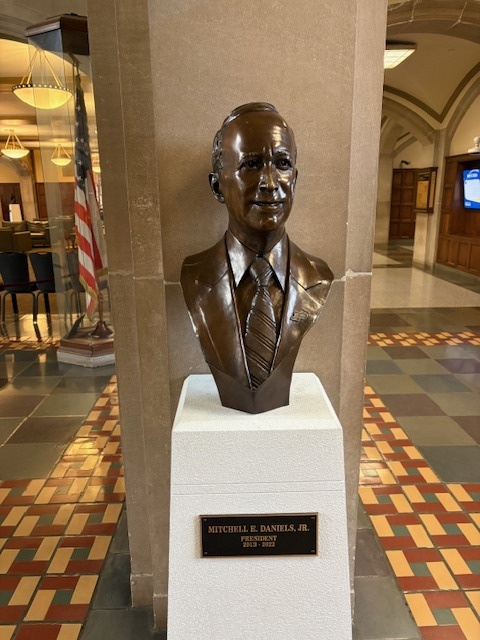

Using reverse image search with the keyword "Purdue University," we identify this statue as a campus landmark. It honors Mitch Daniels, Purdue's 12th president (2013-2022). By cross-referencing campus imagery, building maps, and this [journal source](https://www.jconline.com/picture-gallery/news/local/purdue/2023/12/08/purdue-university-unveils-bronze-bust-honoring-mitch-daniels/71854956007/), we confirm that it is located in Purdue Memorial Union (PMU).

**First letter: `P`** (Building Code: PMU)

### 2

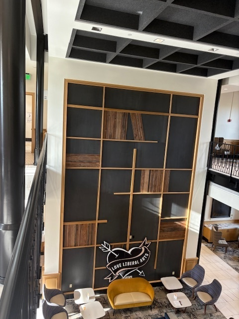
This image has a very classic "old academic building" style: traditional interior details, symmetry, and a polished layout that feels like a long-standing campus building rather than a modern complex. Among Purdue's core historic buildings, University Hall is the best match.

An important point is that the image does not resemble an engineering lab, student center, or arts building. It clearly fits a historic academic setting, so UNIV is the most reasonable choice.

**Second letter: `U`** (Building Code: UNIV)
### 3

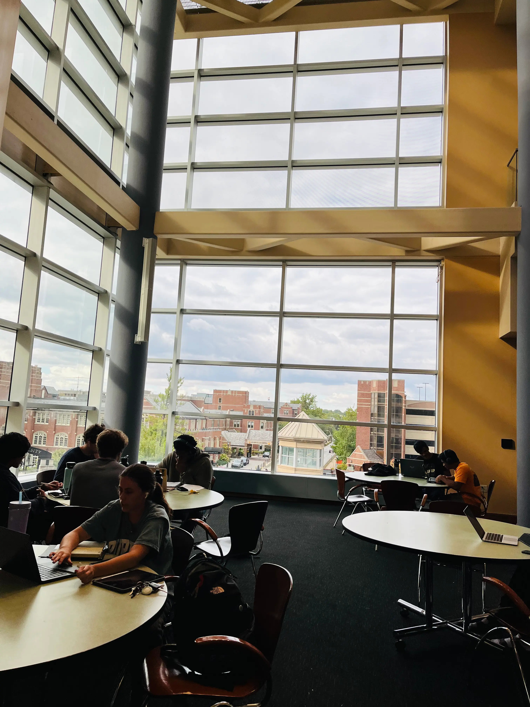

Through visual reconnaissance, we identify the Union Club Hotel visible in the frame. Cross-referencing the hotel's documented location on the Purdue Memorial Union campus map reveals the opposite building across the street as Rawls (Jerry S.) Hall (RAWL). By overlaying visible architectural features with the official campus map, we confirm the geolocation.

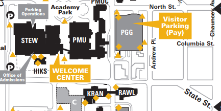

**Third letter: `R`** (Building Code: RAWL) | Hypothesis: "PURDUE_" pattern emerging

### 4
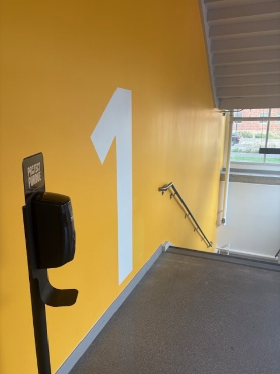

Through detailed visual analysis, we identify distinctive vegetation (two bushes) visible outside the window frame. By systematically scanning Google Street View and satellite imagery across the Purdue campus, we locate the exact matching landscape formation. The window placement correlates with Bailey (Ralph and Bettye) Hall, with Dudley Hall (DUDL) positioned opposite. Satellite imagery confirmation validates the geolocation.

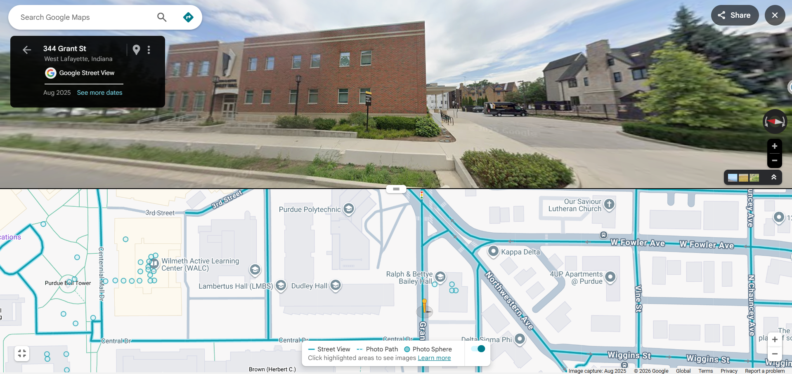

**Fourth letter: `D`** (Building Code: DUDL)

### 5

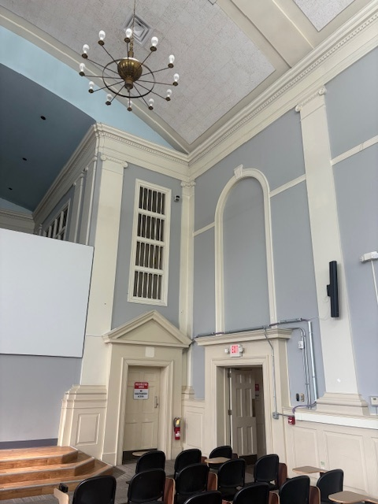

Reference: https://www.reddit.com/r/mildlyinteresting/comments/s9b5gp/my_university_converted_a_nearby_church_into_a/

One comment explicitly identifies this as Purdue's University Church. The architectural features in our challenge image match the Reddit photo, except for a black speaker that appears to have been moved or changed.

The University Church building code is UC, so the fifth letter is `U`.

### 6

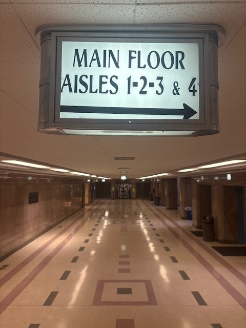
This is a strong image because it contains a direct identifier: the "MAIN FLOOR AISLES" sign. The signage style and interior layout clearly match Elliott Hall of Music.

In addition, Elliott is a large performance venue, so the aisle and seating configuration is very different from a standard academic building.

**Sixth letter: `E`** (Building Code: ELLT)

### 7

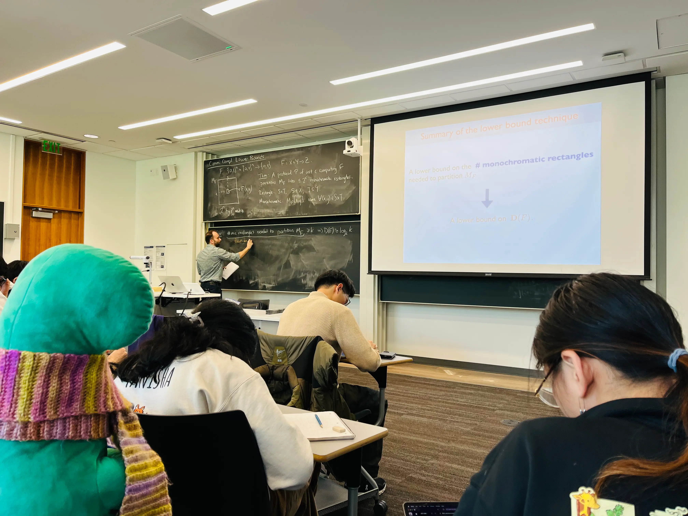
Image details: The classroom has a green EXIT sign and a toy dinosaur.

Reasoning: Standard EXIT signs in Purdue buildings are typically red. Combined with a generic classroom interior and no strong Purdue-specific markers, this is likely the first off-campus decoy.

**Seventh letter: `_`** (Off-campus confirmation)

### 8

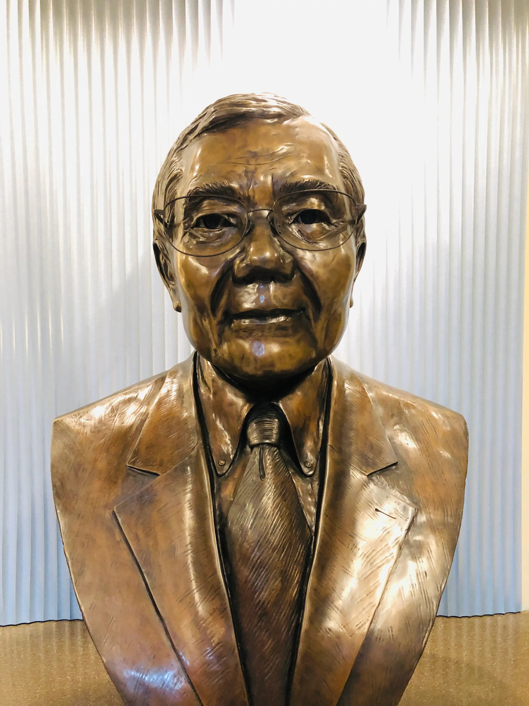

Using reverse image search with "Purdue University" and cross-referencing institutional records, we identify this person as Professor Ei-ichi Negishi (1935-2021). Official Purdue newsroom archives and [institutional announcements](https://www.purdue.edu/newsroom/archive/releases/2021/Q2/ei-ichi-negishi,-one-of-2-nobel-prize-winners-from-purdue-university,-dies.html) confirm that his bust is located in Wetherill Laboratory of Chemistry (WTHR).

**Source Document:**
> "On Purdue's campus today, a bronze bust of Negishi beside that of his mentor Brown is on permanent display in Wetherill Laboratory of Chemistry. Negishi's bust was dedicated in April 2014."

**Eighth letter: `W`** (Building Code: WTHR)

### 9

Visual analysis identifies the Ross-Ade Stadium scoreboard structure visible in the background. Cross-referencing the camera angle and building proximity with official campus mapping and Google Street View satellite data, we determine the photograph's position relative to multiple candidates: CQNW, CQNE, CQW, and CQE—all within the Cary (Franklin Levering) Quadrangle complex. All candidates share the same building code prefix, providing definitive confirmation.

**Ninth letter: `C`** (Building Code: CARY) 

### 10

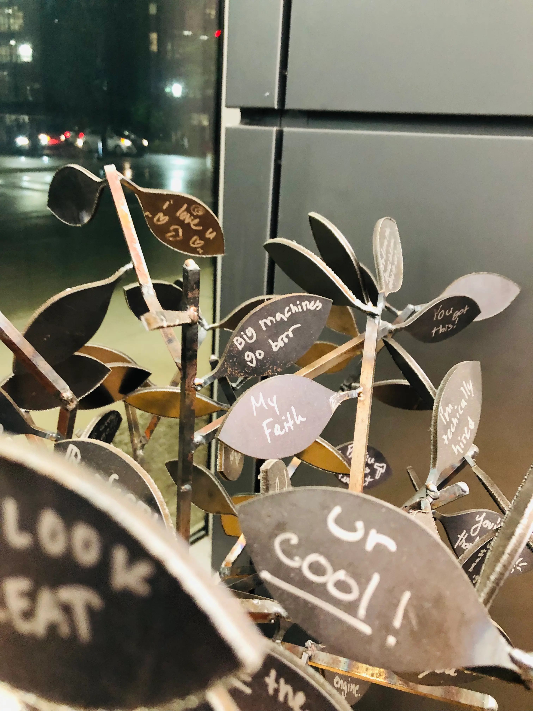

Through systematic visual reconnaissance, we identify three key indicators:

1. **Landmark analysis**: A distinctive metal tree sculpture with student-signed leaves (a documented engineering achievement marker).
2. **Architectural signature**: Modern gray wall panels and window mullion patterns consistent with a high-tech facility.
3. **Infrastructure confirmation**: A visible traffic signal near the building approach.

Cross-referencing these features with social media sources (Instagram/Facebook campus content), we find corroborating images that show identical architectural elements at Bechtel Innovation Design Center:

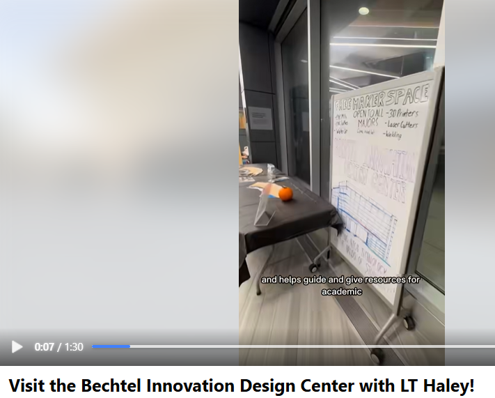

Satellite imagery confirms the building's intersection with a traffic-controlled crossway. 

**Tenth letter: `B`** (Building Code: BIDC)

### 11

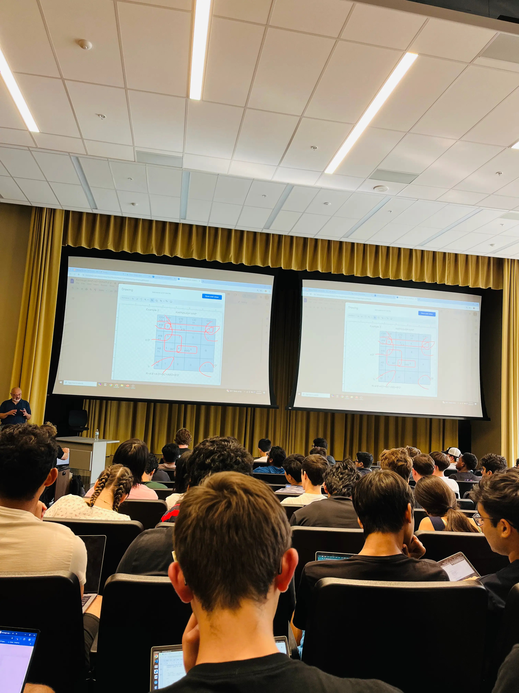

I found this page after brute-forcing several room ID candidates: https://www.purdue.edu/activelearning/walcrooms1/Theater.php

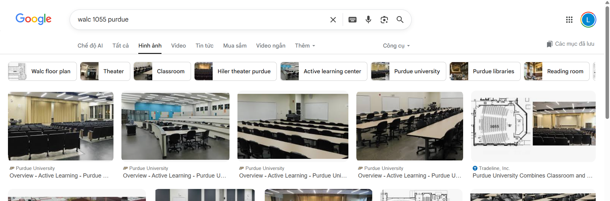

The room layout and seating arrangement match the photo, confirming the location as the Wilmeth Active Learning Center.

**Eleventh letter: `W`** (Building Code: WALC)

### 12

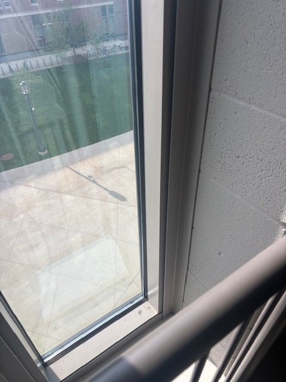

Through targeted social media reconnaissance (Instagram), we identify user-generated content depicting identical location features: matching bicycle rack configurations and window patterns from [documented campus posts](https://www.instagram.com/p/C20hhpPJZC-/?img_index=6).

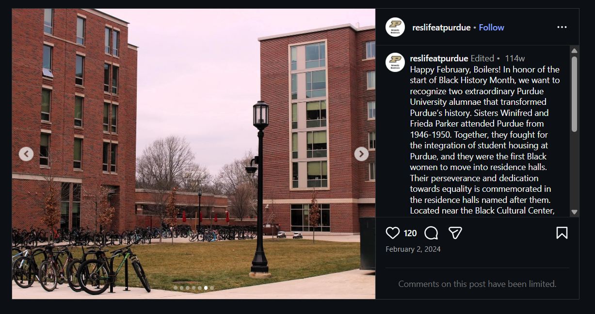

Correlating the imagery with campus landmark references indicates that this location is at Winifred and Frieda Parker Halls, adjacent to the Black Cultural Center. The likely candidates are PKRF and PKRW, which share the same first letter. Based on Google Street View alignment, PKRF is the better match:

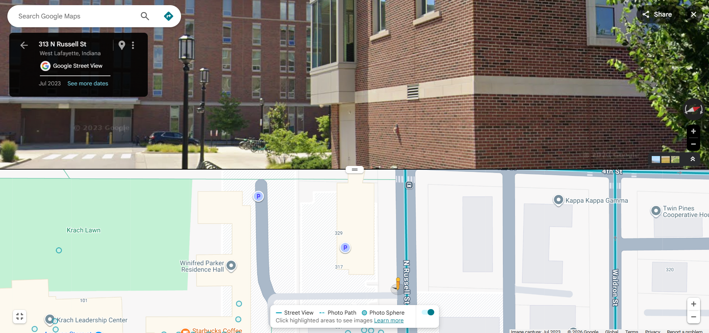

**Twelfth letter: `P`** (Building Code: PKRF)

### 13

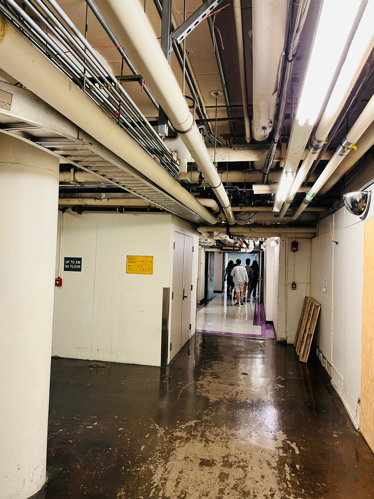

A keyword search for "up to E18 1st floor" returns institutional directory results. Cross-referencing E18 and E25 with Purdue's building code system shows no valid Purdue match. Further research identifies these as MIT facility designations, confirming that this image is off campus.

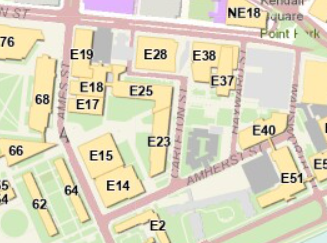

**Thirteenth letter: `_`** (Off-campus confirmation)

### 14

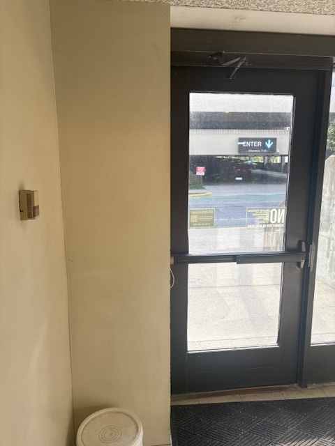

Visual analysis reveals a distinctive parking lot configuration immediately adjacent to the building entrance. Through systematic comparison with satellite imagery and campus infrastructure databases covering all Purdue parking facilities, we achieve a definitive match:

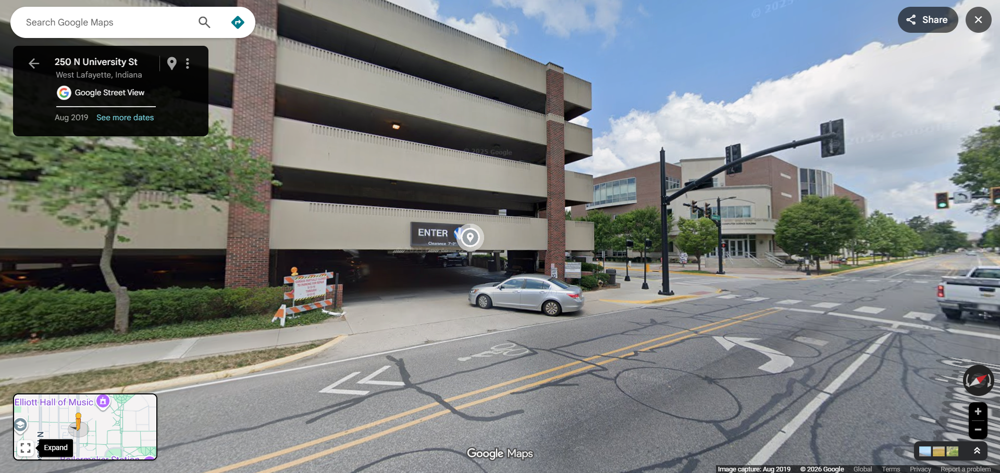

The parking lot signature uniquely corresponds to the entrance area of Haas (Felix) Hall. Satellite confirmation validates the geolocation:

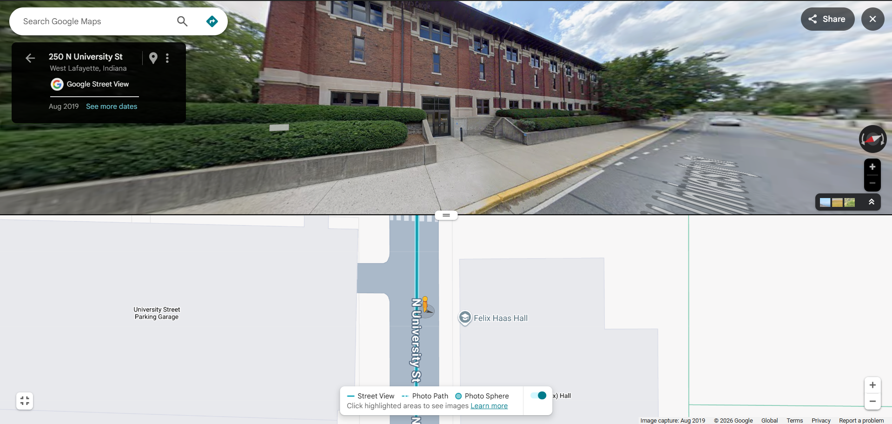

**Fourteenth letter: `H`** (Building Code: HAAS)

### 15

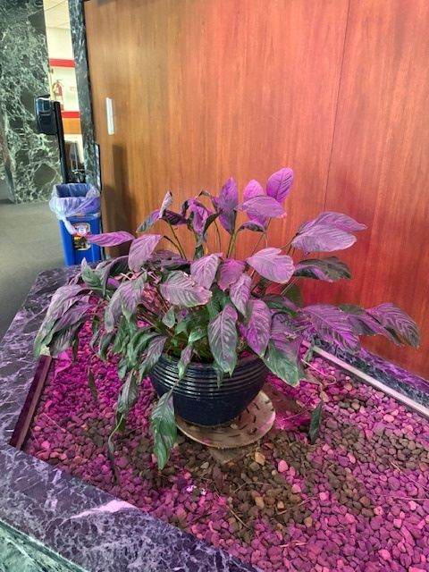

This image was one of the hardest to verify directly with open-source references. After solving the other 21 images and checking the remaining flag constraints, the only consistent value for this position is `L`.

**Fifteenth letter: `L`**

### 16

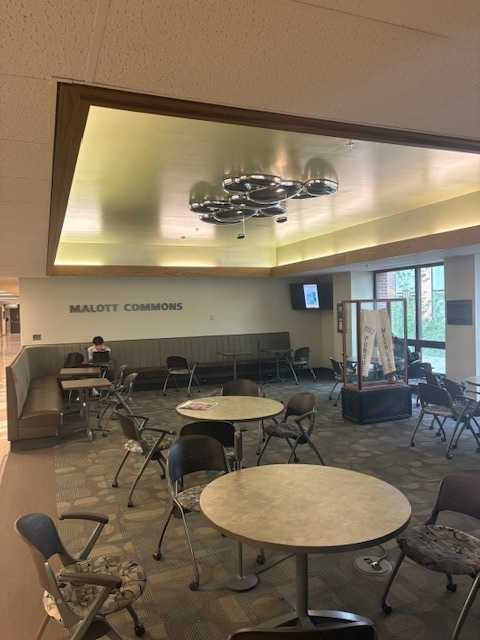

Through targeted searches of institutional media repositories and student publications, we find corroborating documentation for this location. Cross-referencing [archived campus news coverage](https://www.purdueexponent.org/purdue-study-areas/collection_624c9392-1377-11e5-87f0-af8e7080430f.html) with visual markers in the photo confirms Potter (A.A.) Engineering Center.

**Sixteenth letter: `P`** (Building Code: POTR)

### 17

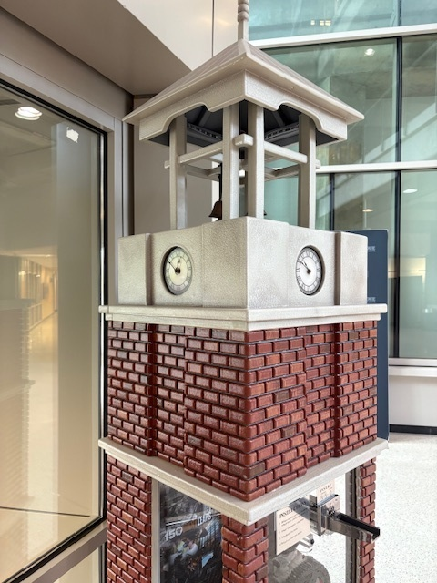

Through social media reconnaissance and tracking of student projects shared on institutional platforms, we identify the [project installation context](https://www.instagram.com/p/DDKgJ4MxV18/). The media metadata and caption confirm placement in Armstrong Hall, a known venue for student installations and academic exhibits.

**Seventeenth letter: `A`** (Building Code: ARMS)

### 18

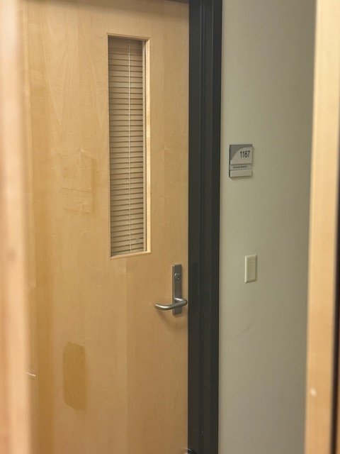

Using the keyword search "room 1167 purdue university," we locate institutional directory information. Cross-referencing the room number with faculty databases shows that the office belongs to Mr. Bianchi ([institutional profile](https://www.cs.purdue.edu/people/faculty/antoniob.html)). Faculty directory entries confirm the location is in LWSN (Lawson (Richard and Patricia) Computer Science Building).

**Eighteenth letter: `L`** (Building Code: LWSN)

### 19

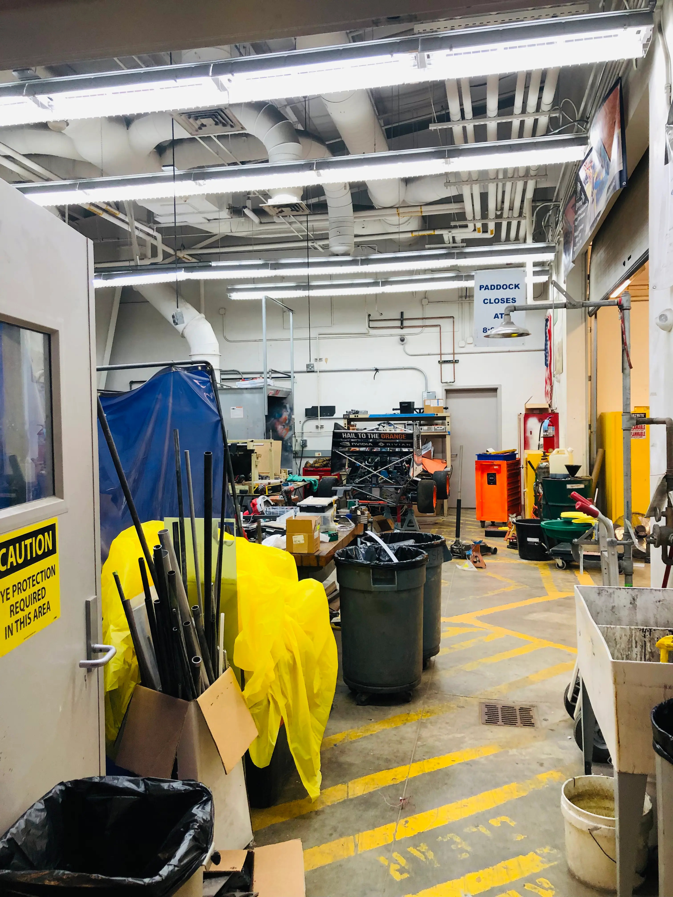

Visual analysis identifies the slogan "Hail to the Orange" in the frame. This slogan is associated with the University of Illinois, not Purdue University. That institutional marker confirms the photo was taken at a non-target location.

**Nineteenth letter: `_`** (Off-campus confirmation)

### 20

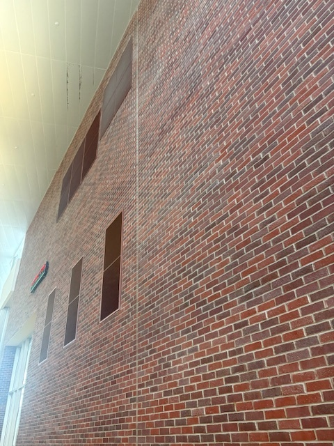

I searched YouTube for Purdue University vlogs and found this video: https://www.youtube.com/watch?v=KcYQEVQp1Uw

At 15:07, the wall pattern and interior design closely match the challenge image.
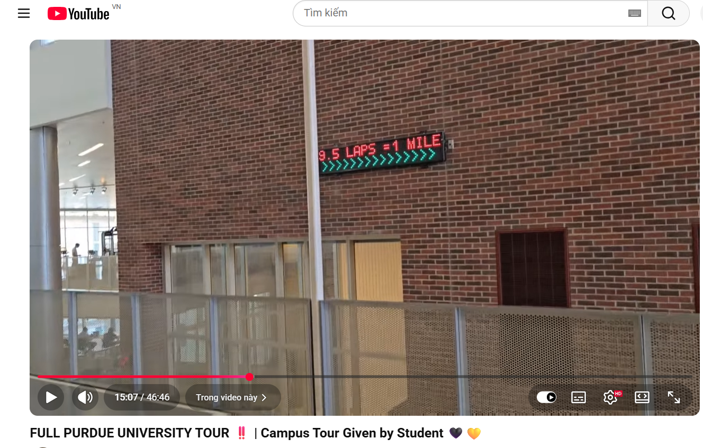

**Twentieth letter: `C`**

### 21

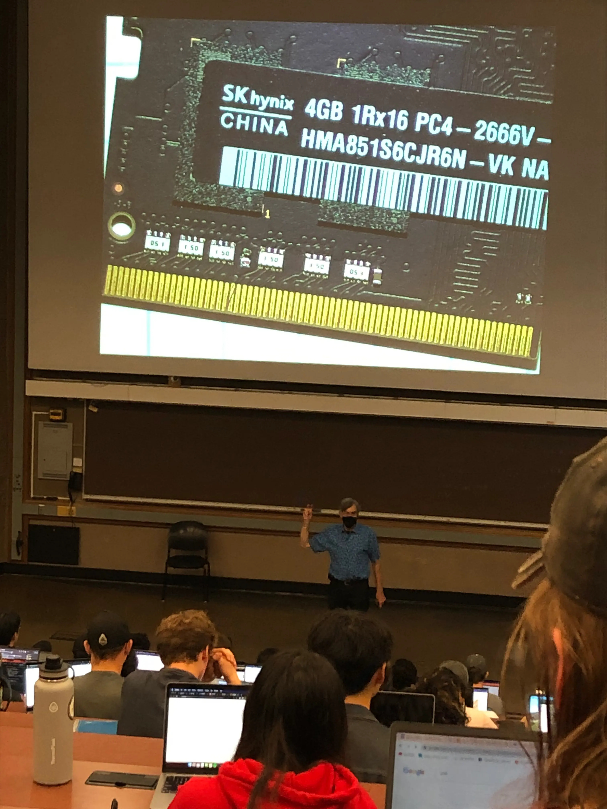

Similar to image 20, I verified this one through a Purdue vlog: https://www.youtube.com/watch?v=j2y4QBjkYnQ&t=195s

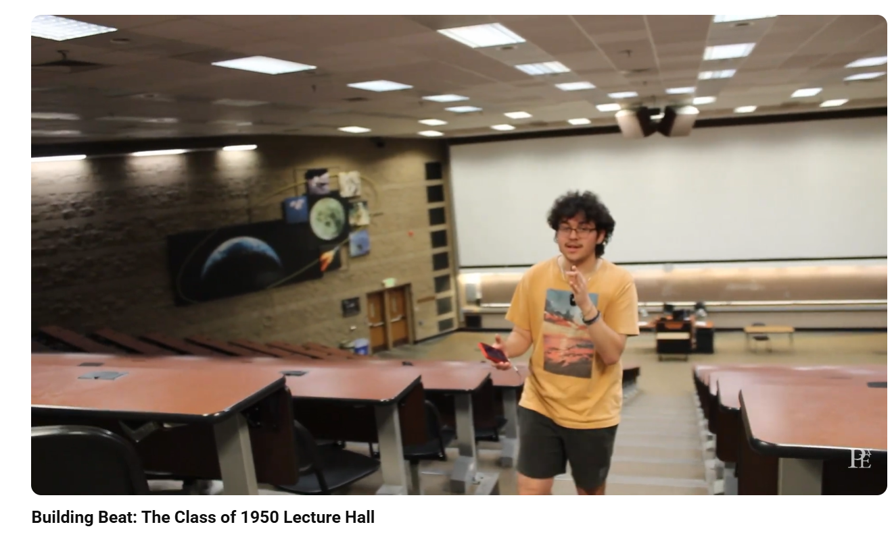

**Twenty-first letter: `C`**

### 22

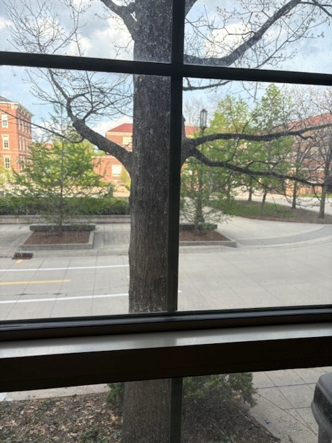

Through systematic geospatial analysis, we identify converging location identifiers:

1. **Structural signature**: Two buildings with contrasting heights, one with a distinctive L-shaped floor plan.
2. **Landscape signature**: A cycling path with a unique curved layout.
3. **Micro-landmarks**: Two trees with a specific spatial relationship.

Cross-referencing these combined features against campus satellite imagery and master planning documents reveals the exclusive match at Fountains Park. The architectural and landscape signatures uniquely correspond to Matthews Hall's location:

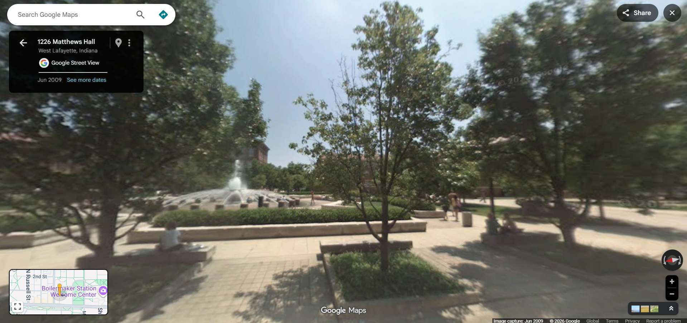

**Final letter: `M`** (Building Code: MTHW)

`bctf{PURDUE_WCBWP_HLPAL_CCM}`
