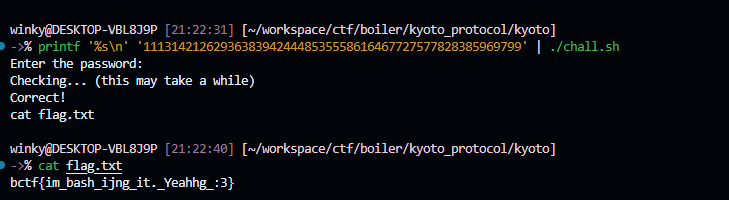

# kyoto_protocol

**Category:** Rev

## Description

> bash head with pipe

## Overview
This challenge is a self-rewriting Bash VM disguised as a tiny wrapper script. At first glance `chall.sh` is only:

```bash
#!/usr/bin/env bash
./chall
```

but that is only the bootloader. The stripped PIE ELF rewrites `chall.sh` into a much larger generated Bash program, and that generated script repeatedly calls back into `./chall $LINENO ...`. In other words, the real checker is split across two layers:

1. a generated Bash instruction tape,
2. a native ELF that interprets the current line number and arguments as VM instructions.

So the correct mindset is not “find the string compare in the binary”, but “dump the generated VM program, reconstruct the state machine, and solve the combinatorial puzzle it encodes”. The solve path used here was:

- log the generated Bash as it is emitted,
- observe that the script consists of fixed-width instruction records,
- emulate the generated control flow while tracking exported `g_*` variables,
- recover the 14 major subset checks and their required scores,
- map the 81 hidden variables to a 9×9 grid,
- solve the resulting row/column/box + subset-count constraints,
- filter the remaining candidates with the late hidden rolling checks,
- concatenate the final selected cells into the password.

That process recovers the accepted password:

```text
111314212629363839424448535558616467727577828385969799
```

and the flag:

```text
bctf{im_bash_ijng_it._Yeahhg_:3}
```

## Technical details
The archive contains:

```text
kyoto/chall
kyoto/chall.sh
kyoto/flag.txt
```

`chall` is a stripped 64-bit PIE ELF, and the shell script initially does nothing except execute it. The important realization is that the ELF does not perform the full password check directly. Instead, it first rewrites `chall.sh` into a generated script and then uses the combination of shell line numbers and recursive `./chall $LINENO ...` invocations as a VM bytecode stream.

### Generated Bash as fixed-width bytecode
A key simplification came from noticing that the generated `chall.sh` is emitted in fixed-width records:

- a 28-byte header,
- then one command per line,
- every line padded to 200 bytes plus a newline,
- so every instruction occupies exactly 201 bytes.

That means instruction slot `gi` can be read directly by seeking to:

```text
28 + (gi - 1) * 201
```

A tiny helper is enough to read any instruction slot:

```python
def read(path, gi):
    with path.open('rb') as f:
        f.seek(28 + (gi - 1) * 201)
        data = f.read(201)
    return data.decode('latin1', 'ignore').rstrip(' \n\x00')
```

This turns the rewritten shell script into something much closer to a bytecode tape than a free-form script.

### Logging the generated VM program
To recover that program, the cleanest method is to hook `fwrite()` and log every 201-byte write while `./chall` regenerates `chall.sh`. A minimal `LD_PRELOAD` logger is sufficient because each VM instruction is written in one fixed-size `fwrite()` call:

```c
#define _GNU_SOURCE
#include <dlfcn.h>
#include <stdio.h>
#include <unistd.h>
#include <fcntl.h>
#include <string.h>
#include <stdlib.h>

typedef size_t (*fwrite_fn)(const void*, size_t, size_t, FILE*);
typedef long (*ftell_fn)(FILE*);

static fwrite_fn real_fwrite = NULL;
static ftell_fn real_ftell = NULL;
static int fd = -2;

static void init(void) {
  if (!real_fwrite) real_fwrite = (fwrite_fn)dlsym(RTLD_NEXT, "fwrite");
  if (!real_ftell) real_ftell = (ftell_fn)dlsym(RTLD_NEXT, "ftell");
  if (fd == -2) {
    const char *p = getenv("LOGFILE");
    if (!p) p = "writes_fast.log";
    fd = open(p, O_WRONLY | O_CREAT | O_APPEND, 0644);
  }
}

static void wnum(long x) {
  char b[64];
  int n = snprintf(b, sizeof(b), "%ld", x);
  if (fd >= 0 && n > 0) write(fd, b, n);
}

size_t fwrite(const void *ptr, size_t size, size_t nmemb, FILE *stream) {
  init();
  size_t n = size * nmemb;
  if (n == 201) {
    long pos = real_ftell ? real_ftell(stream) : -1;
    if (fd >= 0) {
      write(fd, "@", 1);
      wnum(pos >= 0 ? pos / 201 + 1 : -1);
      write(fd, ":", 1);
      write(fd, ptr, n);
    }
  }
  return real_fwrite(ptr, size, nmemb, stream);
}
```

Compile and run it like this:

```bash
gcc -shared -fPIC logwrite_fast.c -o logwrite_fast.so -ldl
printf '#!/usr/bin/env bash\n./chall\n' > chall.sh
LOGFILE=$PWD/writes_fast.log LD_PRELOAD=$PWD/logwrite_fast.so bash ./chall.sh <<<'wrong'
```

That gives a line-indexed dump of the generated VM program.

### Important early state from the trace
The early generated script immediately reveals several important state variables:

```text
export g_8694=93
export g_4968=72
export g_2431=15
export g_3694=27
echo "Enter the password:"
read -n 100 input
echo "Checking... (this may take a while)"
```

The trace also shows that the input string is expanded into byte variables such as `i0`, `i1`, `i2`, ...:

```text
export input=wrong
export i0=119
export i1=114
export i2=111
export i3=110
export i4=103
```

So the checker is not comparing the password as one opaque string. It is operating on individual byte values and updating many hidden `g_*` variables as it goes.

### Emulating the Bash VM
Once the script is viewed as fixed-width bytecode, it becomes tractable to write a small emulator that:

- skips comments, padding, and pure shell noise,
- applies `export name=value` into an environment dictionary,
- understands `cmd1 && cmd2 || cmd3`,
- and only treats the recursive form `./chall $LINENO ...` as the real VM instruction.

One subtle point is that when replaying a slot `gi`, the generated script expects `$LINENO` to match the real line number in the live shell script. In the emulator that was handled by replacing the second argument with `gi + 2` before launching `./chall`, so the line-number-dependent behavior stayed consistent.

### Recovering the 14 major checks
The most important commands in the trace have the form:

```text
./chall $LINENO 7776 <idx> <x>
```

A real run reveals 14 such top-level checks, with fixed values:

```python
fixed = [57, 24, 49, 46, 11, 47, 56, 35, 66, 50, 19, 79, 21, 41]
```

Those `x` values are emitted by the generated program itself; the password only controls how much each check scores. The success path later requires the rolling accumulators:

```text
g_8694 = 1820085546
g_4968 = 1410707190
```

These are not random large integers. They decode as base-11 rolling hashes using the recovered seeds 93 and 72. Reversing the recurrence:

```text
h_next = h_cur * 11 + digit
```

yields the required score digits:

```text
seed 93 -> [4, 4, 3, 3, 2, 3, 4]
seed 72 -> [4, 3, 4, 2, 2, 1, 2]
```

So the 14 major subset-count targets are:

```python
target = [4, 4, 3, 3, 2, 3, 4, 4, 3, 4, 2, 2, 1, 2]
```

This is the first major collapse of the problem: instead of “guess a password”, the task becomes “find a hidden selection mask that makes each of 14 subset checks score the required count”.

### Recovering the variable subsets
Each `7776` top-level check consults a specific subset of hidden `g_*` variables. To recover those subsets, one can run small synthetic scripts containing a single `7776` invocation, seed the required accumulators, hook `getenv()`, and record which `g_*` names are read before the corresponding accumulator changes.

That reconstructs 14 subsets such as:

```python
subsets = [
    ['g_4136', 'g_8883', 'g_4387', 'g_6974', 'g_8511', 'g_5070', 'g_1559', 'g_9076'],
    ['g_2093', 'g_1484', 'g_9230', 'g_4184', 'g_9999', 'g_7918', 'g_9342', 'g_7534'],
    ['g_9283', 'g_8715', 'g_7941', 'g_8883', 'g_7833', 'g_2988', 'g_8511', 'g_3110'],
    ['g_2497', 'g_4590', 'g_5505', 'g_5819', 'g_4136', 'g_5793', 'g_3935', 'g_6974'],
    ['g_8356', 'g_2812', 'g_3049', 'g_5466', 'g_9560', 'g_3333', 'g_6630', 'g_5311'],
    ['g_4590', 'g_5505', 'g_9283', 'g_2206', 'g_8883', 'g_3935', 'g_6974', 'g_2988'],
    ['g_2206', 'g_4136', 'g_8883', 'g_3935', 'g_2988', 'g_2045', 'g_5070', 'g_1559'],
    ['g_9999', 'g_3812', 'g_7534', 'g_1611', 'g_1900'],
    ['g_6974', 'g_2988', 'g_8511', 'g_5070', 'g_9076', 'g_8902', 'g_4412', 'g_4689'],
    ['g_8715', 'g_7941', 'g_1804', 'g_4387', 'g_1277', 'g_8511', 'g_3110', 'g_7980'],
    ['g_6560', 'g_5466', 'g_4545', 'g_8904', 'g_6630', 'g_8508', 'g_2399', 'g_9532'],
    ['g_8228', 'g_7976', 'g_6118', 'g_7345', 'g_4706'],
    ['g_4545', 'g_9560', 'g_5551', 'g_6630', 'g_3650', 'g_9532', 'g_3862', 'g_9074'],
    ['g_9074', 'g_7918', 'g_9342', 'g_8715', 'g_1804', 'g_4387', 'g_7833', 'g_1277'],
]
```

At that point the VM is no longer opaque. It has become a small family of subset-count constraints over hidden variables.

### Mapping the 81 hidden variables to a 9×9 grid
The next stage reads 81 distinct `g_*` variables, and those turn out to be the cells of a hidden 9×9 board. The mapping can be recovered by:

1. logging the variable names read during the later `./chall $LINENO 5784` stage,
2. forcing one variable at a time to `0`,
3. observing the triple of one-hot decimal outputs `(g_7965, g_1829, g_2184)`.

Each of those outputs is a 9-digit one-hot decimal mask, so the position of the non-zero digit gives one coordinate. A helper like this is enough:

```python
def digit_pos(n):
    s = f'{n:09d}'
    return [i for i, ch in enumerate(s) if ch != '0']
```

For example, the trace contains entries like:

```text
g_9074 -> (1000, 10000, 10000) -> [5, 4, 4]
```

which means `g_9074` maps to row 5, column 4, box 4 in zero-based indexing.

Doing this for all 81 variables yields a unique `(row, col, box)` triple for each one, with the expected 9×9 structure:

- 81 variables total,
- 81 unique triples,
- each row index appears exactly 9 times,
- each column index appears exactly 9 times,
- each box index appears exactly 9 times.

This proves the hidden `g_*` variables are exactly the cells of a 9×9 grid.

### Turning the trace into a combinatorial problem
At this point the challenge is finally cleanly stated. Let `x_n ∈ {0,1}` denote whether hidden cell `n` is selected. The constraints are:

- exactly 3 selected cells in each row,
- exactly 3 selected cells in each column,
- exactly 3 selected cells in each 3×3 box,
- and for each recovered subset `subsets[i]`, the number of selected cells must equal `target[i]`.

Formally:

```text
sum_{n in row r} x_n = 3
sum_{n in col c} x_n = 3
sum_{n in box b} x_n = 3
sum_{n in subsets[i]} x_n = target[i]
```

This can be solved with MILP or exact cover. A compact model using `scipy.optimize.milp` is sufficient. That recovers a 27-cell selection mask, though the linear constraints do not make the solution unique by themselves.

### Killing the remaining ambiguity with the late checks
The remaining ambiguity is removed by two late rolling accumulators:

```text
g_2431 = 972076578
g_3694 = 1718772620
```

These decode as base-13 rolling recurrences with seeds 15 and 27. In practice, the easiest final filter is:

1. enumerate candidate 27-cell masks from the MILP or exact-cover stage,
2. replay each candidate through the emulator or real checker,
3. keep the one that reaches those exact final accumulator values.

That yields the unique selected cells, sorted in row-major order:

```text
11 13 14 21 26 29 36 38 39 42 44 48 53 55 58 61 64 67 72 75 77 82 83 85 96 97 99
```

Each selected cell is encoded as a two-digit coordinate `(row+1)(col+1)`, so concatenating them gives the accepted password:

```text
111314212629363839424448535558616467727577828385969799
```

### Success path detail
One interesting internal detail in the later success path is that the generated program emits an 81-byte hex blob and then hashes it with SHA-256:

```text
export key=354c21221f2141625a1e2b4f275d3a4b4c33592139323238415c5c27623c3f3c253328392761605d28633a2455363d524c544b433152593d612b3830275f27273352294f2c553d255558474b433d63273f
export key=$(echo -n $key | xxd -r -p | sha256sum | awk '{print $1}')
```

The 162 hex digits correspond to 81 bytes, which matches the 81-cell model exactly. So the final structure is:

- the password selects a 27-cell mask,
- the mask drives the rolling subset checks,
- the hidden 81-cell state is collapsed into a raw byte string,
- that byte string is hashed,
- and the success branch writes `flag.txt`.

You do not need to fully reverse that last key schedule to solve the challenge. Recovering the correct 27-cell mask is enough.

## Proof-of-Concept
- Step 1: Log the generated Bash checker while `./chall` rewrites `chall.sh`.

```bash
gcc -shared -fPIC logwrite_fast.c -o logwrite_fast.so -ldl
printf '#!/usr/bin/env bash\n./chall\n' > chall.sh
LOGFILE=$PWD/writes_fast.log LD_PRELOAD=$PWD/logwrite_fast.so bash ./chall.sh <<<'wrong'
```

This produces a line-indexed dump of the VM program, where each instruction occupies one 201-byte slot.

- Step 2: Emulate the generated instruction tape, recover the 14 subset targets, reconstruct the 81-cell grid mapping, and solve the resulting row/column/box + subset-count constraints.

The crucial intermediate outputs are:

```python
target = [4, 4, 3, 3, 2, 3, 4, 4, 3, 4, 2, 2, 1, 2]
solution_cells = [11, 13, 14, 21, 26, 29, 36, 38, 39, 42, 44, 48, 53, 55, 58, 61, 64, 67, 72, 75, 77, 82, 83, 85, 96, 97, 99]
```

- Step 3: Concatenate the recovered cell coordinates and verify them against the live checker.

```bash
printf '%s\n' '111314212629363839424448535558616467727577828385969799' | ./chall.sh
cat flag.txt
```

Observed output:



## P/S
The trick that makes this challenge solvable is recognizing that the rewritten Bash script is structured data, not just annoying generated shell. Once you treat the 201-byte records as bytecode and the late `g_*` variables as a hidden Sudoku-like board, the whole checker collapses into a clean combinatorial model plus a couple of rolling-hash filters.